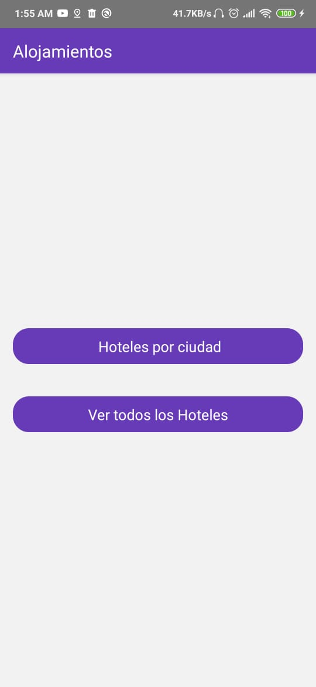
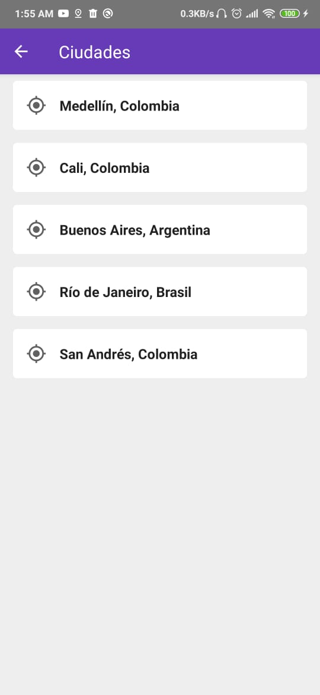
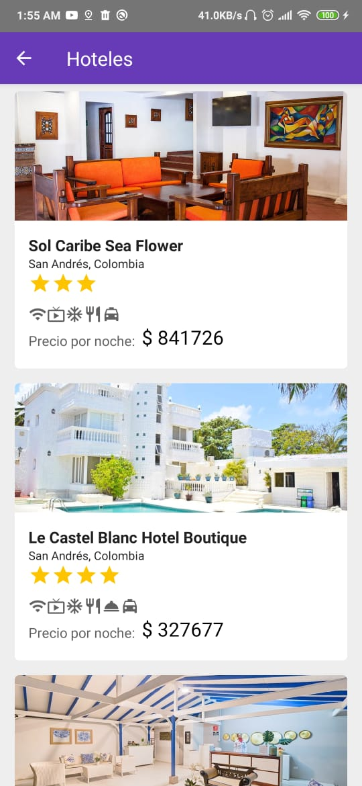
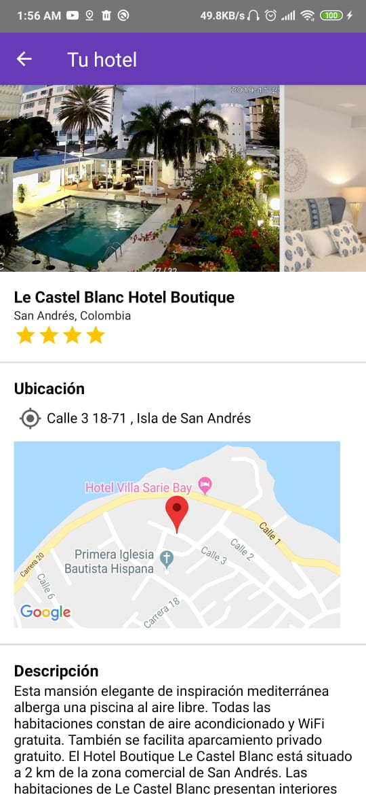

# AlmundoAPP

AlmundoAPP es una aplicación que permite consultar una lista de hoteles y hoteles por ciudad. Además presenta un detalle de los hoteles con su ubicacion en Maps.

<div style="display:flex;flex-direction:row;justify-content: space-between">
    
    
    
    
</div>

### Inicio

 * Asegúrese de tener Node (`v10.15.1`+) , NPM y NPX (`6.4.1`+)
 
`AlmundoAPP` es una aplicación móvil realizada en `react-native`, si no está familiarizado con este Framework visite https://facebook.github.io/react-native/docs/getting-started
 

```bash
# Clonar repositorio 
$ git clone https://github.com/daniel-alzate/AlmundoAPP.git

# Instalar dependencias con NPM
$ npm install

# Iniciar app con dispisitivo Android
$ npx react-native run-android
```

 ## Dependencias
 
Para el desarrollo de la APP se utilizó:

 * `react-native-maps: 0.26.1`
 * `react-native-vector-icons: ^6.6.0`
 * `react-navigation: ^4.0.10`
 * `react-navigation-stack: ^2.0.5`
 
  ## Autor
  Daniel Alzate


 

